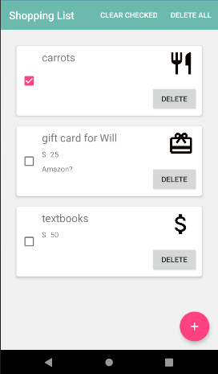
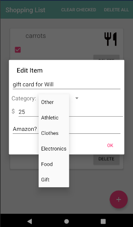

# Shopping List
Shopping List is a class project from Mobile Software Development (taught by Péter Ekler at AIT Budapest). It is an Android application that stores items users add to their shopping list in a database and allows them to edit and remove items.

## Features
This application gives the user a simple way to create and update their shopping list on their device. Items can be added to the list using the floating + button, and users can enter information about the item they need to buy, including name, category, estimated price, and any other details they would like to enter. These items appear on the main shopping list page with any information entered by the user and an icon reflecting the category they selected. Items can be edited by clicking on the item in the list and using the Edit Item dialog, or deleted individually at any point. The user can also check off items they have bought and clear all the checked items, or they can delete all items from their list.





The application starts with a customized animation on a splash screen, which leads straight into the main list Activity. The application uses RecyclerView to efficiently store items in the list view, and it is backed by a Room database which updates automatically when the user changes any information.

## Repo Structure
For simplicity, only relevant files and directories (i.e. files created or modified by me, not auto-generated by Android Studio) are included in this diagram.

```
├── README.md                           : Description of this repository
│
└── ShoppingList/app                    : Project files
    ├── src/main                    
    │   ├── java/.../shoppinglist       : Primary Kotlin classes for the project
    │   │   ├── adapter                 : ShoppingListAdapter.kt (adapter for the RecyclerView)
    │   │   │
    │   │   ├── data                    : Kotlin classes for database elements
    │   │   │   ├── AppDatabase.kt      : Database holder
    │   │   │   ├── Item.kt             : Item entity class
    │   │   │   └── ShoppingListDAO.kt  : DAO with database queries
    │   │   │
    │   │   ├── AddItemDialog.kt        : Dialog fragment for adding and editing items
    │   │   ├── ShoppingListActivity.kt : Primary shopping list activity
    │   │   └── SplashScreenActivity.kt : Splash screen activity defining animation listener
    │   │
    │   ├── res                         : companion resource files for the project
    │   │   ├── anim                    : animation xml file for the splash screen
    │   │   ├── drawable                : xml files for category icons, add item button, and launcher icon
    │   │   ├── layout                  : xml layout files for activities (shopping list, splash screen), dialog box, and item row
    │   │   ├── menu                    : main menu xml file
    │   │   ├── mipmap-...              : launcher icon versions for different screen densities
    │   │   └── values                  : xml files for extracted strings and customized styles
    │   │
    │   └── AndroidManifest.xml         : manifest file for the application
    │
    └── build.gradle                    : gradle file for the app module
```

## Future Improvements
I would like to add several additional features to the app, including incorporating several TouchHelper elements. I would like to replace the delete button on each item with swipe to delete, and I would like to introduce the capability to move items around on the list by dragging and dropping.


### Contributors
Jessie Baskauf

Some basic code adapted from Péter Ekler's demo projects
